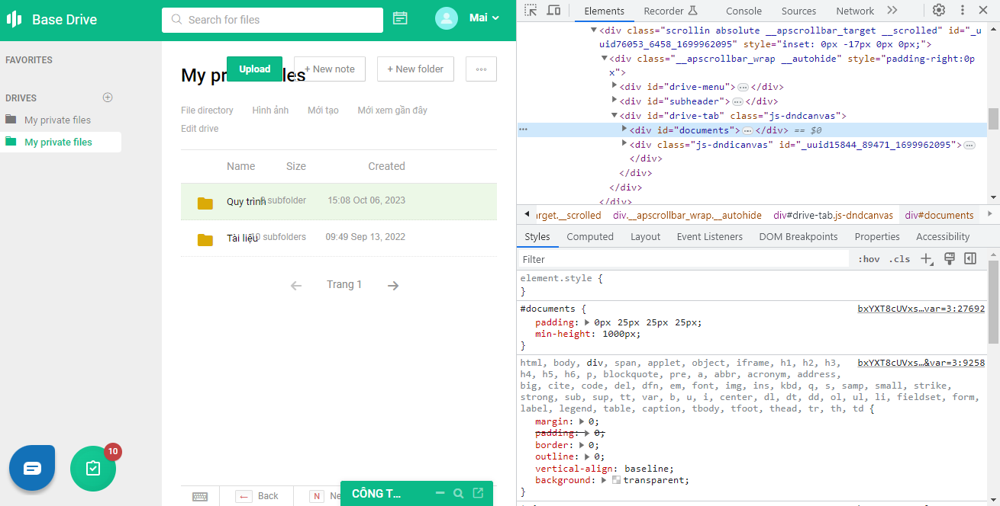
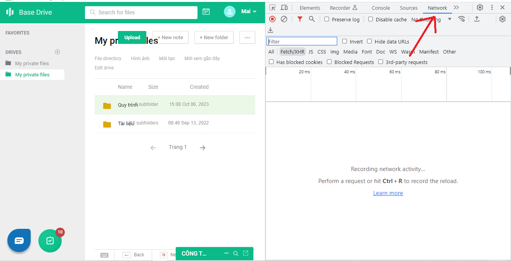
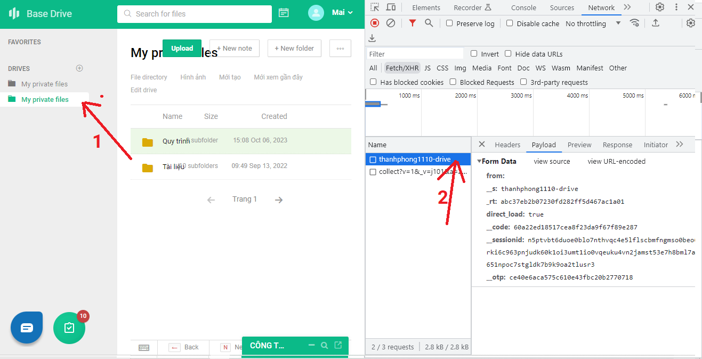

# Craw Files and Folders

## Download
[Download Zip](./product.zip)

## Cách dùng
Truy cập vàp trang https://drive.base.vn
Ấn **F12** hoặc chuột phải chọn **inspect element** để mở dev tool.

  

Chọn qua tab **net work**.

  

Click vào thư mục gốc của bạn (1), chọn **thanhphong..**

  

Tại tab **payload**, hãy lấy những thông tin này cho vào file **config.json**

Cuối cùng chạy file exe tương ứng.